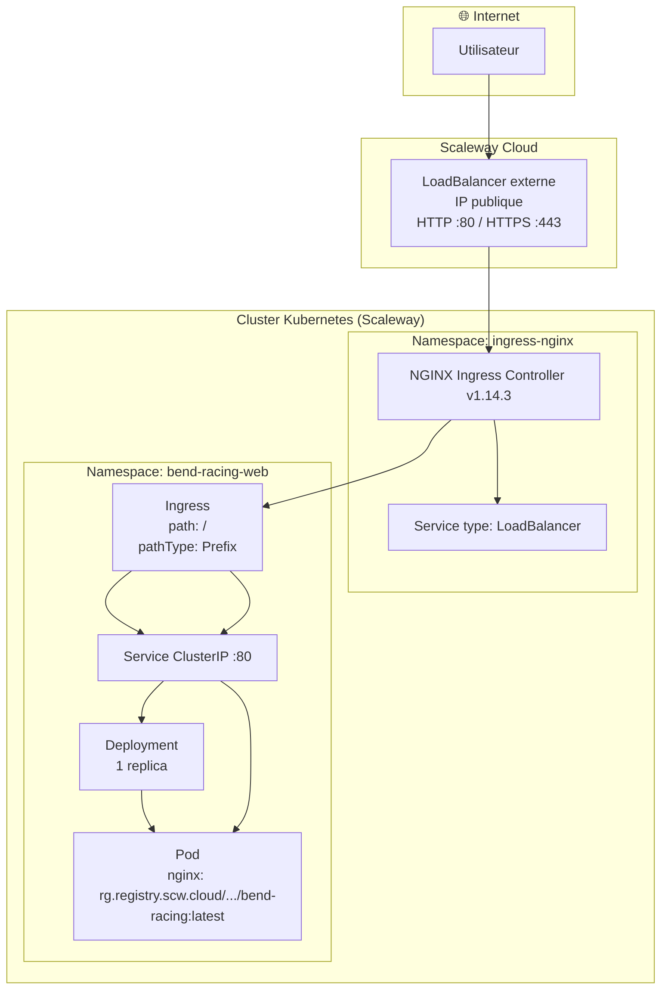
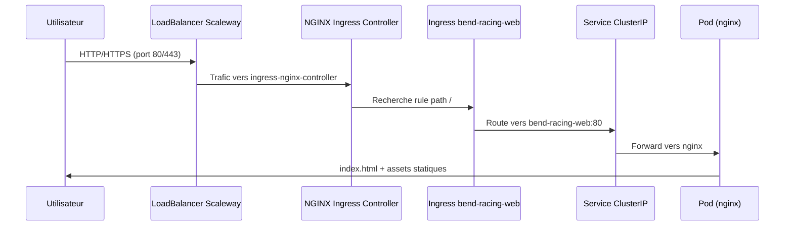
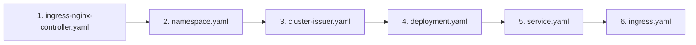
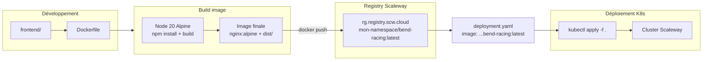
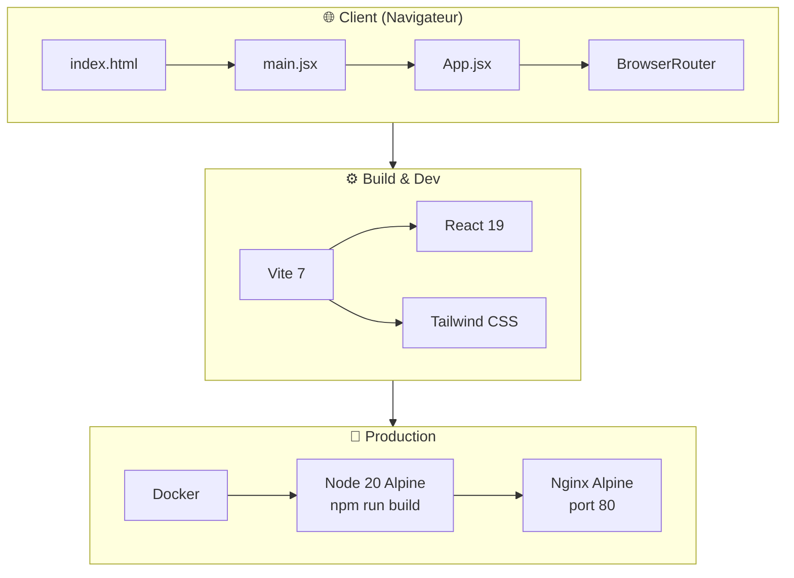
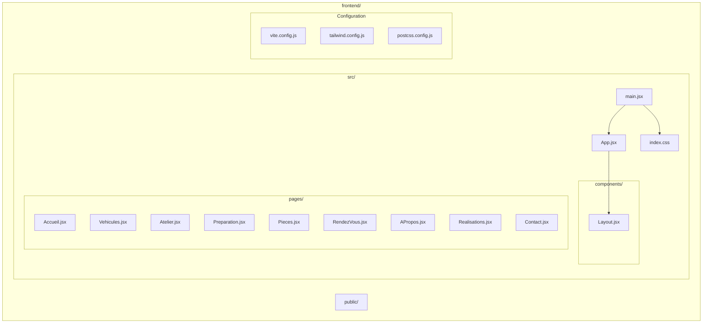
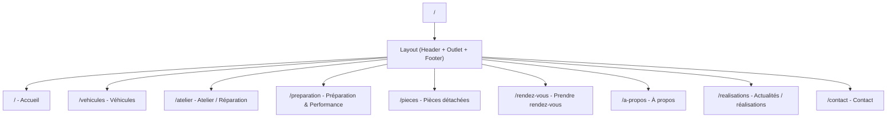
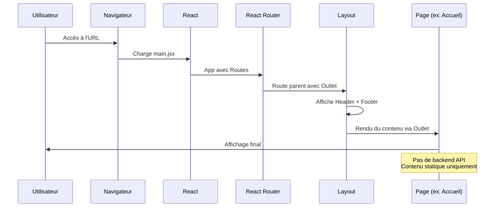
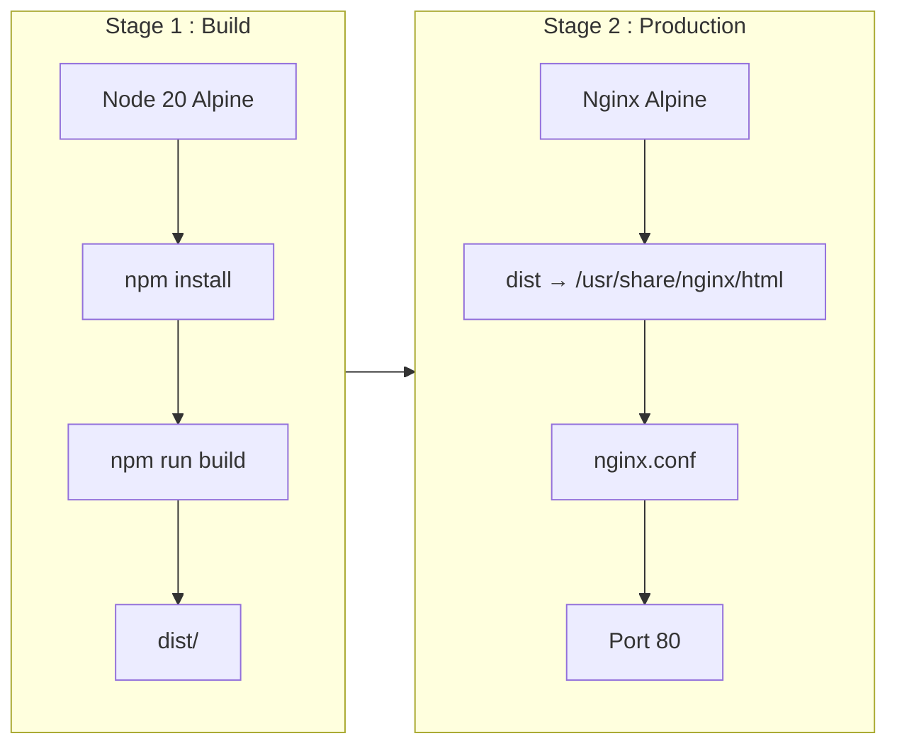
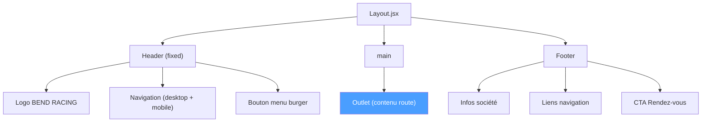

# Schéma de l'architecture Bend Racing Web

## Vue d'ensemble

Application web **SPA (Single Page Application)** React pour Bend Racing – spécialiste 2 roues : achat, préparation moteur, réparation et performance. Déployée sur **Kubernetes (Scaleway)** avec NGINX Ingress.

---

## Infrastructure complète (Kubernetes + Ingress)

---

## Flux trafic HTTP (de l'utilisateur au Pod)

---

## Manifests Kubernetes (ordre d'apply)

| Fichier | Rôle |
|---------|------|
| `ingress-nginx-controller.yaml` | NGINX Ingress Controller + Service LoadBalancer (Scaleway provisionne l'IP publique) |
| `namespace.yaml` | Namespace `bend-racing-web` |
| `cluster-issuer.yaml` | ClusterIssuer Let's Encrypt pour certificats TLS automatiques |
| `deployment.yaml` | 1 Pod nginx avec image `rg.registry.scw.cloud/mon-namespace/bend-racing:latest` |
| `service.yaml` | Service ClusterIP exposant le port 80 |
| `ingress.yaml` | Route `bend-racing.fr` / `www.bend-racing.fr` → Service bend-racing-web:80 (TLS, HTTP→HTTPS) |

---

## Pipeline Build → Deploy

---

## Application (frontend)

---

## Structure du projet

---

## Arborescence des routes (React Router)

---

## Flux de données & rendu

---

## Stack technique

| Couche | Technologie | Version |
|--------|-------------|---------|
| Framework | React | 19.2 |
| Build | Vite | 7.3 |
| Routing | React Router DOM | 7.6 |
| Styling | Tailwind CSS | 3.4 |
| Production serveur | Nginx (Alpine) | - |
| Conteneurisation | Docker | Multi-stage |
| Langage base | JavaScript (ES modules) | - |
| **Orchestration** | **Kubernetes (Scaleway)** | - |
| **Ingress** | **NGINX Ingress Controller** | 1.14.3 |
| **Registry** | **Scaleway Registry** | rg.registry.scw.cloud |

---

## Pipeline de déploiement Docker

---

## Composants Layout

---

## Points clés

### Application
- **SPA statique** : pas d’API backend, contenu entièrement côté client
- **Navigation** : React Router avec routes imbriquées sous `Layout`
- **Responsive** : menu burger pour mobile, navigation horizontale pour desktop
- **Build** : image Docker multi-stage (build Node + serveur Nginx)

### Infrastructure
- **Kubernetes Scaleway** : cluster managé, manifests versionnés sur GitHub
- **Ingress NGINX** : LoadBalancer externe Scaleway → IP publique auto-provisionnée
- **Flux** : Internet → LB → Ingress Controller → Ingress (path /) → Service → Pod nginx
- **Image** : `rg.registry.scw.cloud/mon-namespace/bend-racing:latest`
- **Déploiement** : `kubectl apply -f .` (ordre : ingress-controller → namespace → deployment → service → ingress)
